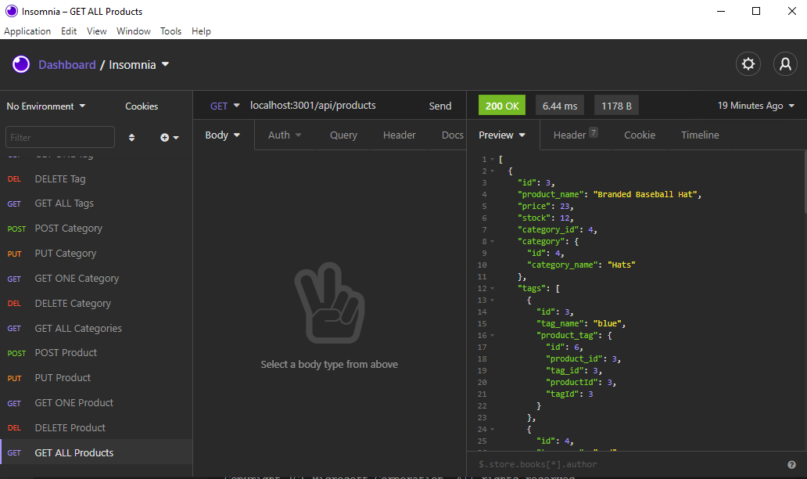

# E-Commerce Back-End

## Table of Contents
    
1. [Description](##description)
2. [Installation Instructions](##installation-instructions)
3. [Usage Information](##usage-information)
4. [Contribution Guidelines](##contribution-guidelines)
5. [Test Instructions](##test-instructions)
6. [Questions](##questions)
7. [License](##license)
8. [Screenshot](##screenshot)
    
    
## Description
The goal of this project was to develop the back-end of an e-commerce program using Express and Sequalize to interact with a MYSQL database. The user can retrieve various products and categories as well as update, delete, and create new ones.
    
## Installation Instructions
This is project is not deployed to a live server and must be run locally. To install first clone the repository from github and install the required node modules by executing "npm install". Next  edit the .env.example to reflect your MYSQL username and password and remove ".example" from the file name. Connect to mysql and execute "source db/schema.sql" to create the database, and then "exit" mysql. To seed the database execute "npm run seed", after database has been seeded you can start the server by executing "npm run start".
    
## Usage Information
To utilize the program you can use your browser or a program like Insomnia to navigate to (default) localhost:3001. The program contains CRUD routes for categories, products, and tags at "/api/(target)".
    
## Contribution Guidelines
This program is not currently accepting community contributions.
    
## Test Instructions
This program does not contain a built in test suite. There is a known bug with POST Product and PUT Product displaying "400 Bad Request", data is created/updated as expected however. If further bugs are discovered please send a detailed report to the developer, contact information can be found in the questions section.
    
## Questions
If you have further questions about the functionality of this application or need clarification regarding certain areas the creator can be contacted at: 
Email: trevor.eckberg@gmail.com  
Github: https://github.com/trev-eck/
    
## License
This application was developed under the MIT License

## Screenshot
A live version of the application is deployed at: Not Applicable

A video walkthrough of the program can be found at: https://drive.google.com/file/d/1xdcWSP5jFKPb6A3aQWAVfz5fAuf_DDZp/view

This readme was generated using the ReadME Generator : https://github.com/trev-eck/readme-generator